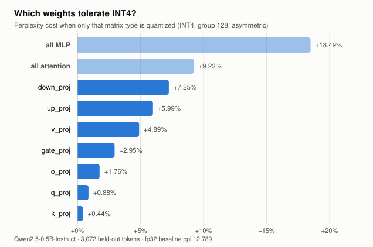

# tinyinfer

An LLM inference engine written from scratch — no PyTorch `generate()`, no `transformers`, no `llama.cpp`. The safetensors parser, the tokenizer, the forward pass, the KV cache, the sampler, and the quantizer are all implemented here.

Target model: **Qwen2.5-0.5B-Instruct**. Target hardware: **Apple M5, 24 GB**.

```
$ python scripts/generate.py --chat "Explain what a KV cache does in one sentence."
A KV cache is a data structure that stores frequently accessed data in memory,
allowing for quick retrieval of information.

[23 tokens in 2.21s — 10.4 tok/s, cache=on, quant=none]
```

---

## Status

| Phase | State | Result |
|---|---|---|
| 1. Parse safetensors | ✅ | 290 tensors, 494,032,768 params, every shape cross-checked against config |
| 2. BPE tokenizer | ✅ | 10000/10000 exact id match and exact round-trip vs reference |
| 3. fp32 forward pass | ✅ | logits within 4.44e-04 of reference (tol 1e-3), top-1 100% at every position |
| 4. KV cache | ✅ | output ids **identical** to uncached, 1.27×→5.71× as context grows 32→512 |
| 5. Sampling | ✅ | temperature / top-k / top-p, seeded and reproducible |
| 6. Quantization + study | ✅ | INT8 free, INT4 costly, and the cost is **not uniform** — see below |
| 7. Metal compute kernels | 🔨 | benchmark harness and stage timings in place; kernels not started |
| 8. Benchmark vs llama.cpp | ⛔ | not started |

Phases 1–6 are Python + NumPy, correctness first. Phases 7–8 move the hot path to C++/Metal.

## The finding

Quantization is usually reported as one number per bit width. That hides the more useful result: **weight matrices do not degrade equally.** Quantizing only `k_proj` to INT4 costs +0.44% perplexity. Quantizing only `down_proj` — same bit width, same group size, same bits saved — costs **16× more**.

<picture>
  <source media="(prefers-color-scheme: dark)" srcset="results/quant_sensitivity_dark.svg">
  
</picture>

Measured on 3,072 held-out tokens, fp32 baseline perplexity **12.7891**.

### 1. INT8 is free. INT4 is not, and the cliff is right below it.

| Scheme | Perplexity | Δ | Compression |
|---|---|---|---|
| fp32 | 12.7891 | — | 1.00× |
| INT8 g128 asym | 12.7754 | **−0.11%** | 3.88× |
| INT4 g32 asym | 14.6141 | +14.27% | 6.40× |
| INT4 g128 asym | 16.4615 | +28.72% | 7.53× |
| INT3 g64 asym | 36.6353 | +186.46% | 9.14× |
| INT2 g64 asym | 608,112 | +4,754,844% | 12.80× |

The degradation is **not gradual**. INT8 is indistinguishable from fp32, INT4 is expensive but usable, INT3 nearly triples perplexity, and INT2 destroys the model outright — 608,112 is not a degraded model, it is noise. Anyone planning a bit-width sweep should know the useful range ends at 4.

### 2. Group size is the main lever, and asymmetric is not optional

| INT4 config | Δ perplexity |
|---|---|
| g256 asym | +36.02% |
| g128 asym | +28.72% |
| g64 asym | +19.33% |
| g32 asym | +14.27% |
| g128 **sym** | +42.38% |
| g64 **sym** | +30.10% |

Shrinking groups from 256 to 32 cuts the loss by more than half for ~17% less compression. And at equal group size, dropping the zero point costs about as much as doubling the group — symmetric g64 (+30.10%) is barely better than asymmetric g128 (+28.72%) while storing more metadata. The extra zero point pays for itself.

### 3. MLP is twice as fragile as attention

Quantizing the whole attention block costs +9.23%; the whole MLP block costs +18.49%. Per matrix, the spread runs from `k_proj` (+0.44%) to `down_proj` (+7.25%) — a 16× range at identical bit width.

The obvious move is mixed precision: keep the fragile matrices at INT8, push the robust ones to INT4. **It does not pay off, and that is the more useful finding.**

| Scheme | Perplexity | Δ | Avg bits/weight | Compression |
|---|---|---|---|---|
| uniform INT4 g128 | 16.4615 | +28.72% | 4.25 | 7.53× |
| uniform INT4 **g64** | 15.2611 | **+19.33%** | **4.50** | **7.11×** |
| INT4 + INT8 on `down_proj` | 15.1453 | +18.42% | 5.42 | 5.90× |
| INT4 + INT8 on `down`, `up` | 14.4008 | +12.60% | 6.59 | 4.86× |
| INT4 + INT8 on `down`, `up`, `v` | 13.6471 | +6.71% | 6.62 | 4.83× |

Compare rows 2 and 3. They reach effectively the same quality (+19.33% vs +18.42%), but mixed precision spends **5.42 bits per weight to get there and uniform INT4 at group 64 spends 4.50**. Shrinking the group is simply a more efficient way to spend the same bits than promoting whole matrix types to INT8.

So the sensitivity result is real — the matrices genuinely differ by 16× — but acting on it *at the granularity of matrix type* is the wrong lever. Group size dominates. A finer-grained scheme (per-channel or outlier-aware, as GPTQ and AWQ do) might still win; promoting whole tensors does not.

This was written into the README as a prediction before it was measured, and the measurement contradicted it. Reproduce with `python scripts/mixed_precision.py`.

### 4. Depth barely matters — a negative result

| Blocks quantized to INT4 | Δ perplexity |
|---|---|
| 0–7 (early) | +8.13% |
| 8–15 (middle) | +7.34% |
| 16–23 (late) | +9.30% |

Within about two percentage points of each other. "Protect the early layers" is a plausible and commonly assumed strategy, and on this model it is not supported. Reported because a strategy ruled out is worth as much as one confirmed.

Full numbers: [`results/quant_study.json`](results/quant_study.json). Reproduce with `python scripts/quant_study.py` (~20 min).

## Performance

Apple M5, 24 GB, NumPy fp32 over Accelerate BLAS. Percentiles, not means — a mean hides the stalls that decide whether generation reads as smooth.

| | tok/s | p50 | p99 |
|---|---|---|---|
| prefill | 66.2 | — | — |
| decode | 14.7 | 67.5 ms | 75.2 ms |

Prefill and decode are reported separately because they are different regimes: prefill is compute-bound across the whole prompt, decode is memory-bound on a single token. Averaging them produces a number that describes neither.

**The KV cache speedup is a curve, not a constant.** Phase 4 measured 1.78× at 37 positions and that understates it badly — the cache removes quadratic work, so the win grows with context:

| Context | Cached | Uncached | Speedup |
|---|---|---|---|
| 32 | 7.4 tok/s | 5.8 tok/s | 1.27× |
| 128 | 9.2 tok/s | 2.4 tok/s | 3.83× |
| 256 | 6.9 tok/s | 1.6 tok/s | 4.17× |
| 512 | 3.9 tok/s | 0.7 tok/s | **5.71×** |

Quantized decode currently measures within noise of fp32 (14.7 → 15.0 tok/s), because weights are dequantized to fp32 before the matmul. That is deliberate: it isolates the *quality* cost, which is what the study measures. Throughput gains need a real INT4 kernel — phase 7.

Reproduce with `python scripts/bench.py`; raw numbers in [`results/bench.json`](results/bench.json).

## How it works

```
tinyinfer/
├── safetensors.py  — hand-rolled reader: u64 header length, JSON header, raw
│                     data region. bf16 -> f32 by a 16-bit left shift, because
│                     bf16 is exactly the top half of an f32.
├── tokenizer.py    — byte-level BPE: NFC, special-token split, the Qwen2
│                     pre-tokenization regex, the GPT-2 byte<->unicode
│                     bijection, rank-ordered merging.
├── model.py        — RMSNorm, rotate-half RoPE, grouped-query attention,
│                     SwiGLU, causal masking, tied embeddings, KV cache.
├── sampling.py     — temperature, top-k, top-p, seedable RNG.
├── quant.py        — group-wise INT2/3/4/8, symmetric and asymmetric.
└── eval.py         — sliding-window perplexity.
```

### Details worth knowing

**RoPE uses the rotate-half layout, not interleaved.** Getting this backwards still produces fluent text — just subtly wrong text. It is caught by comparing logits at step one, not by reading the output.

**The KV cache stores rotated keys.** That is what makes it correct: RoPE depends on absolute position, so a key rotated when it was written stays valid forever.

**Cache storage is preallocated, not grown.** Appending with `np.concatenate` recopies the whole history on every token, which quietly reintroduces the quadratic cost the cache exists to remove.

**Quantization is group-wise, not per-tensor.** One scale for an 896×4864 matrix is set by its largest outlier and wastes most of its range on values that never occur.

**Perplexity windows overlap.** Only newly-exposed tokens are scored, so tokens near a window boundary are not penalised for having no context, and the result does not depend on window size.

## Verification

Every phase has a gate that had to pass before the next one started. Reference libraries appear **only** in `tests/`, never in `tinyinfer/`.

```bash
python scripts/inspect_weights.py   # phase 1
python tests/test_tokenizer.py      # phase 2 — 10,000 strings, exact
python tests/test_forward.py        # phase 3 — logits vs transformers
python tests/test_kv_cache.py       # phase 4 — cached == uncached
python tests/test_sampling.py       # phase 5 — reproducibility
python scripts/quant_study.py       # phase 6 — the study
```

The tokenizer corpus covers whitespace runs, CJK, ZWJ emoji sequences, NFC/NFD pairs, raw-byte garbage, code, and embedded chat-template tokens — the cases where a byte-level BPE actually breaks.

## Limitations

- **No GPU path yet.** Everything runs on NumPy over Accelerate BLAS. The tokens/sec figures are what a correctness-first CPU implementation gives you, and are not competitive with llama.cpp. That comparison is phase 8 and will be published whether or not it wins.
- **Quantized weights are dequantized to fp32 before the matmul.** That measures the quality cost exactly, which is what the study is for, but it means quantization currently buys compression and not speed. Real throughput needs the INT4 kernel.
- **One model, one machine.** Everything here is Qwen2.5-0.5B on an M5. Nothing has been checked against a second architecture or a non-Apple target.
- **Perplexity is measured on one corpus** (Alice in Wonderland). It is public-domain, shipped in the repo, and reproducible offline — but a single domain, and the quantization result could differ on code or multilingual text.

## Setup

```bash
python3.12 -m venv .venv && .venv/bin/pip install numpy regex
.venv/bin/python -c "from huggingface_hub import snapshot_download; \
  snapshot_download('Qwen/Qwen2.5-0.5B-Instruct', local_dir='models/Qwen2.5-0.5B-Instruct')"
```

`tokenizers`, `torch`, and `transformers` are needed only to run the tests, where they serve as oracles.

## Build log

[`LOG.md`](LOG.md) — every bug that cost more than an hour, what it looked like, and what it actually was.

## Prior work

A direct sequel to [chip8](https://github.com/iqureshi123/chip8): parse a binary format, implement a spec exactly, verify headlessly against a reference, then optimize. Same discipline, pointed at a transformer instead of a 1970s VM.

## License

MIT
